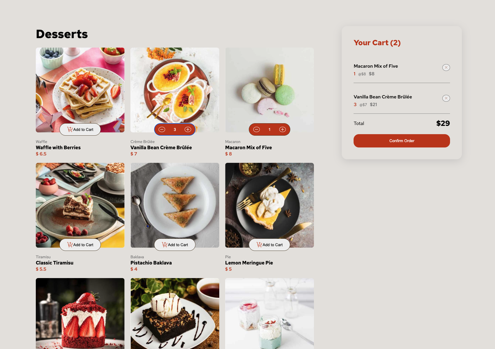

# Javascript Checkout - Cart - Customer Order Training

## Training Description
A Javascript-based checkout system that allows the customer to add and remove as many products as they want to their cart by sampling the sweets category of a commerce project.

The cart automatically includes the total money and order details that the customer has to pay.